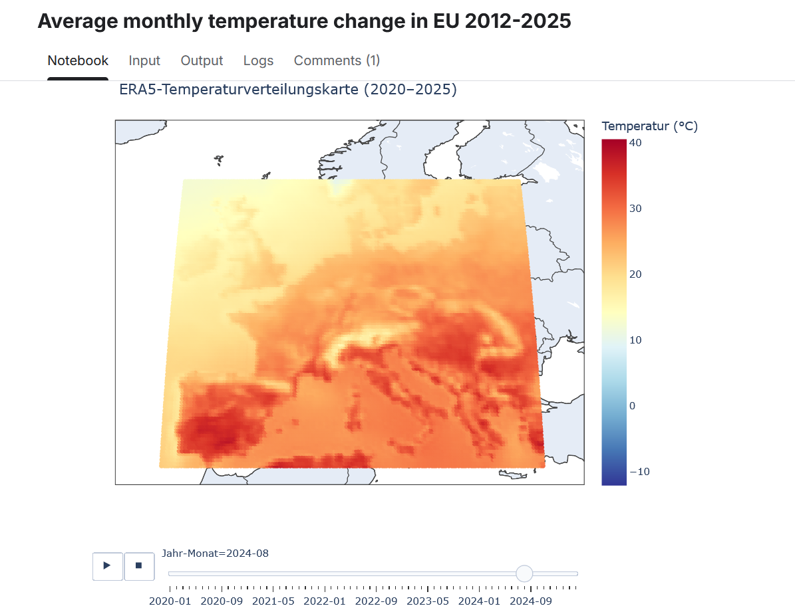
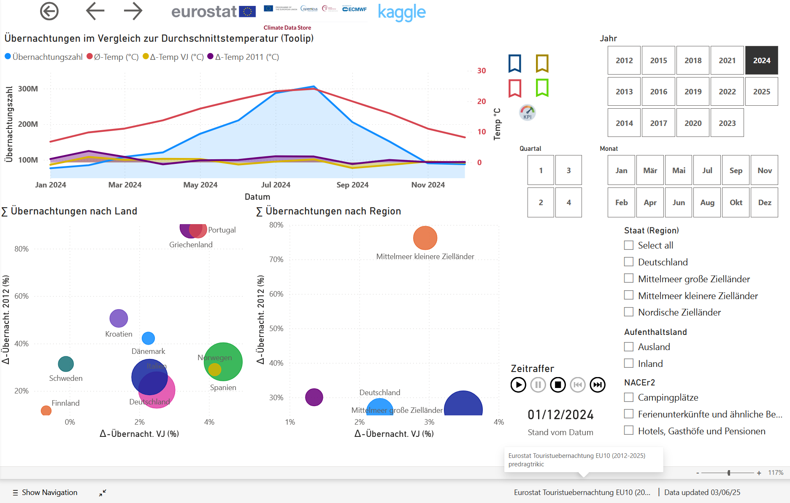
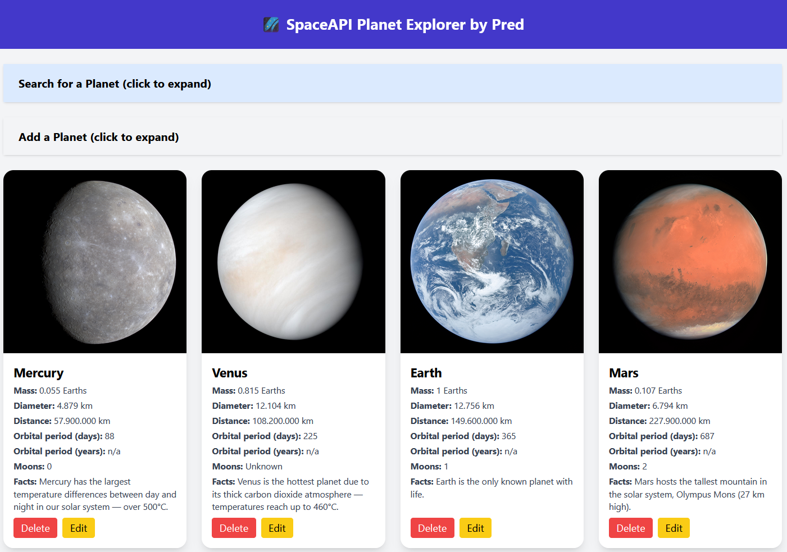

# About Me

Hello there and welcome! 👋

I am an enthusiast exploring the world of **data analysis**, **Python coding**, and sharing projects on **GitHub** and other platforms.  
[Link to my Profile page](https://predragt565.github.io/about_me/) 

---

## Recent Projects

Some of my recent projects have brought me both great fun (and some stress too! 😅):

---

### **"Hot Nights, Cold Bookings"**
A two-part report examining the connection between **ever-increasing average temperatures** and **overnight stays in selected EU destinations**.

- The **temperature report** was built in **Python (Jupyter Notebook)** on **Kaggle**.  
- The **overnight stays report** was built in **Power BI**.

**Links & Preview:**  
- [Average Monthly Temperature Change in EU (2012-2025)](https://www.kaggle.com/code/predragtrikic/average-monthly-temperature-change-in-eu-2012-2025)  
  

- [Power BI Report – Klimawandel und Übernachtungen](https://app.powerbi.com/Redirect?action=OpenReport&appId=7ade7080-799f-412d-b483-0652313c8615&reportObjectId=0082c9ab-3b3c-4b67-ae9a-92a21a2f04a7&ctid=3f997f44-998e-40ab-a814-4db66712c837&reportPage=ecd3e834007b75da93ea&pbi_source=appShareLink)  
  

---

### **"To the SpaceAPI, and Beyond!"**
A new experience in building and deploying an app based on **FastAPI** and **React (Vite)**.  
A great example for testing **containerized app deployment using Docker Hub images**.

**Links & Preview:**  
- [SpaceAPI Project](https://github.com/predragt565/SpaceAPI)
  
